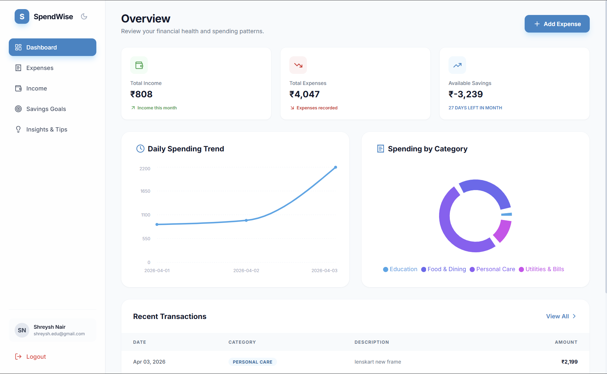
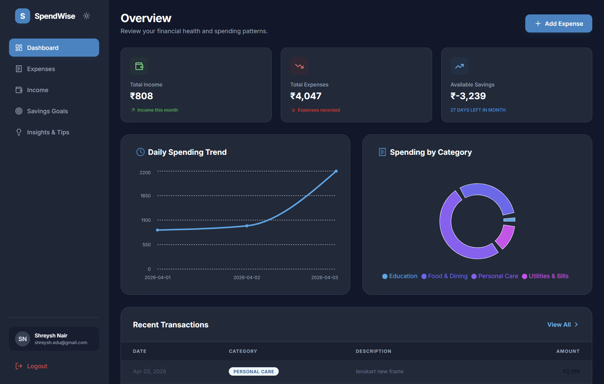

# SpendWise 💰
### **Premium Personal Finance & Savings Intelligence Platform**

SpendWise is a sophisticated full-stack application designed to provide users with deep visibility into their financial health. With automated insights, goal tracking, and a premium dark-mode UI, it empowers users to take control of their spending and maximize their savings.

---

## 🖼️ Visual Showcase
*A glimpse of the premium SpendWise interface.*

| Dashboard | Dark Mode Insights |
|-----------|------------------|
|  |  |

---

## ✨ Key Features
- **📊 Intelligence Dashboard**: Real-time visualization of monthly income vs. expenses with interactive charts.
- **🌓 Dynamic Dark Mode**: Premium dark theme integration across all pages with smart state persistence.
- **📥 Smart Transaction Entry**: Categorized recording of daily expenses and recurring income streams.
- **🎯 Precise Savings Goals**: Set monthly targets and monitor your progress with real-time feedback.
- **💡 AI-Powered Insights**: Personalized recommendations for budget optimization based on spending patterns.
- **🔒 Secure Architecture**: JWT-based authentication, bcrypt hashing, and secure API structure.

---

## 🛠️ Technology Stack
- **Frontend**: React 18, Vite, Tailwind CSS, Framer Motion, Zustand (State Management), Recharts.
- **Backend**: Node.js, Express, TypeScript.
- **ORM & DB**: Prisma with PostgreSQL (Prisma Accelerate for high-performance edge caching).
- **Date Management**: `date-fns` for precise temporal calculations.

---

## 📂 Project Structure
```text
SpendWise/
├── client/              # React frontend application
│   ├── src/
│   │   ├── components/  # Theme-aware UI components
│   │   ├── pages/       # Dashboard, Expenses, Goals, etc.
│   │   ├── store/       # Zustand theme and auth stores
│   │   └── services/    # Axios API client
├── server/              # Express + Prisma backend
│   ├── prisma/          # Database schema and seed data
│   ├── src/
│   │   ├── controllers/ # Business logic
│   │   └── routes/      # REST API endpoints
```

---

## 🚀 Local Setup Guide

### 1. Database Setup
Ensure you have a PostgreSQL instance. Set your connection strings in `server/.env`:
```env
DATABASE_URL="your-postgresql-url"
DIRECT_URL="your-direct-postgresql-url"
JWT_SECRET="generate-a-strong-secret"
```

### 2. Backend Initialization
```bash
cd server
npm install
npx prisma generate
npx prisma migrate dev --name init
# Seed demo data (optional)
npx ts-node prisma/seed.ts
npm run dev
```

### 3. Frontend Initialization
```bash
cd client
npm install
# Configure API URL in .env
echo "VITE_API_URL=http://localhost:5000/api" > .env
npm run dev
```

---

## 🗄️ Database Management
The application uses **Prisma** to manage the PostgreSQL database. You can manage your data easily using the built-in visual tool:

```bash
cd server
npx prisma studio
```
This will open a visual interface at `localhost:5555` where you can view, edit, and delete records for Users, Expenses, Incomes, and Goals.

---

## 🌐 Deployment via Vercel

SpendWise is optimized for deployment on **Vercel**.

### **Backend (Express API)**
1.  Connect your repository to Vercel.
2.  Set the **Root Directory** to `server`.
3.  Add the following **Environment Variables**:
    -   `DATABASE_URL`: Your production PostgreSQL URL.
    -   `JWT_SECRET`: Production secret.
4.  Vercel will automatically detect the Express app if configured with a `vercel.json` (root directory).

### **Frontend (React)**
1.  Create a separate Vercel project or a monorepo workspace.
2.  Set the **Root Directory** to `client`.
3.  Set the **Build Command** to `npm run build`.
4.  Set the **Output Directory** to `dist`.
5.  Add the environment variable:
    -   `VITE_API_URL`: The URL of your deployed backend.

---

## 📄 License
Released under the MIT License. Designed for personal excellence.